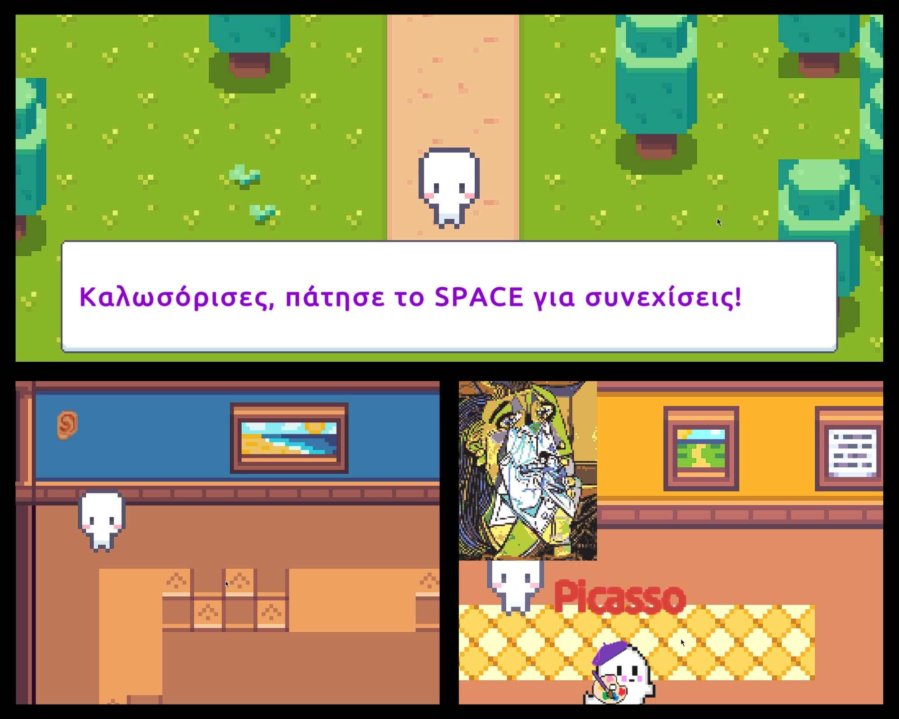

# Ghost Painters

Welcome to Ghost Painters, an exciting, 2D, dialogue-driven, serious game created in Unity Engine where you will travel back in time and come into contact with ghostly painters of the past. In this game, you will explore their world and learn about their lives, their work, and the art movements they participated in. Dialogues of this game are written in Greek language.

### Objective

You will start by entering a room and talk to each painter. Your objective is to talk to each of the ghostly painters and learn about their stories and work.  In each of the following rooms two paintings of a painter are displayed. Inside each room, you can find hints that provide extra information about the painter's life, habits, and artwork. These hints could be in the form of notes or other personal items that give you a deeper understanding of the painter's life. Once you have gathered all the information, your task is to guide each ghost to their corresponding room. 

### Gameplay

As you navigate through the game, you will view the game from a top-down perspective, giving you a bird's eye view of the space. You will move around using the W, A, S, D keys or the arrow keys, and press SPACE to talk to each painter or interact with various elements to progress through the game. Pressing the LSHIFT key enables you to command a ghost to follow you into a designated room.

### Are you ready?

Each painter has their own unique story to tell, and it's up to you to unravel their mysteries. So, are you ready to embark on this fascinating journey and discover the world of the ghost painters? Play Ghost Painters now and find out!

### _Note:_
_If you open the Project in Unity, you need to click "No" when prompted about the Input methods (the game uses the old method)._